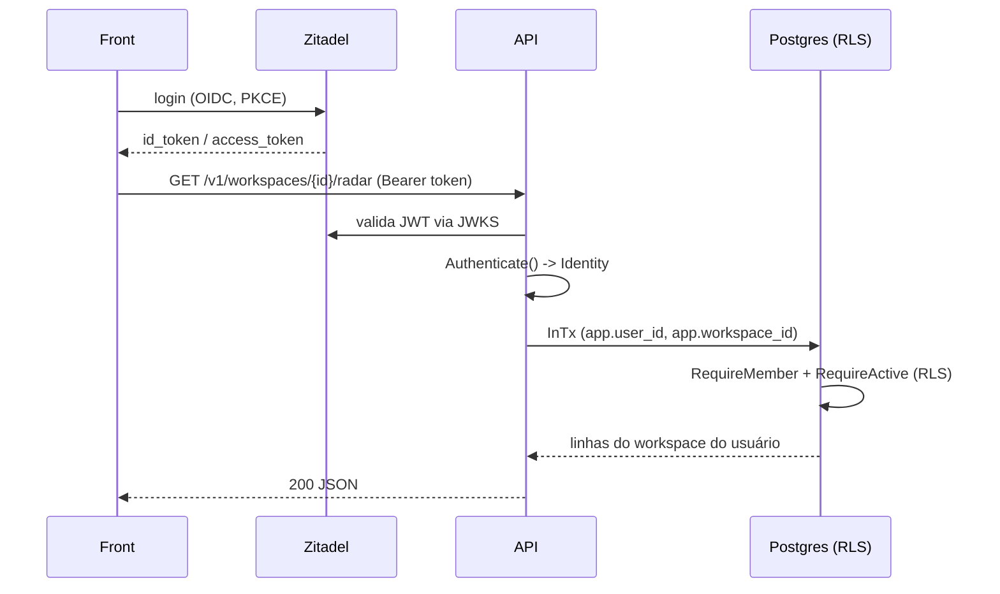
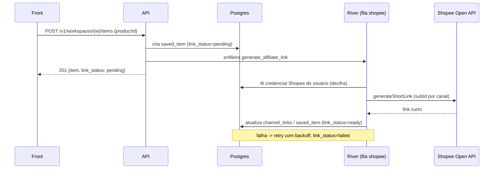
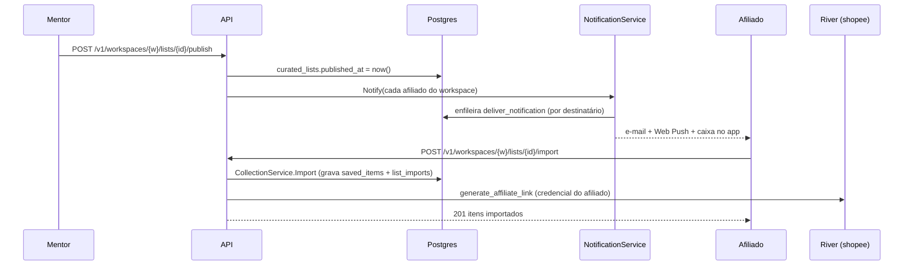
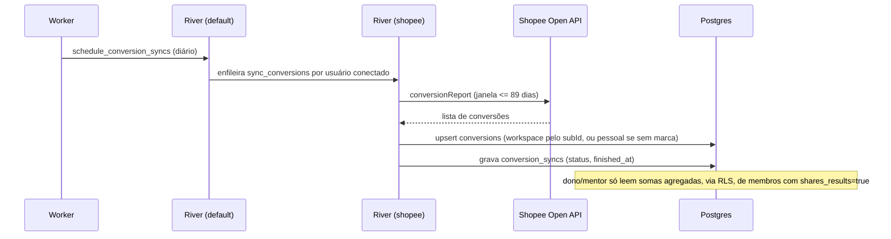
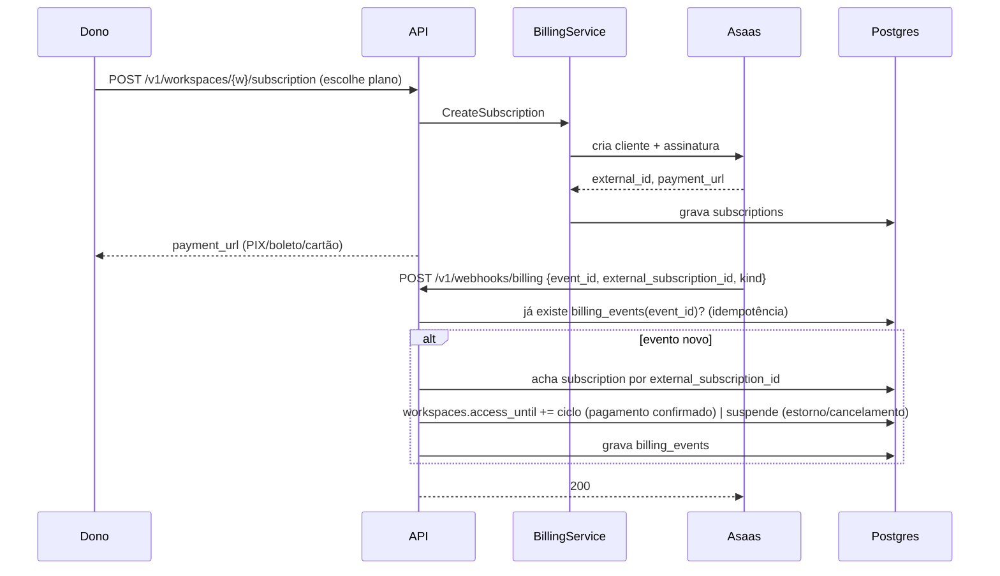
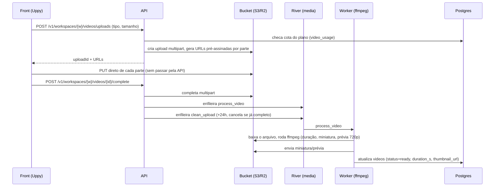

# App Parceiros: documentação técnica

Versão 1 · 06/10/2026 · Retrato do que está desenvolvido até agora (marcos M0 a M7 do MVP, ver `docs/mvp.md` §7, todos mergeados conforme `docs/lancamento.md`).

Este documento consolida arquitetura, stack, modelo de dados, casos de uso implementados, fluxos principais (com diagramas de sequência) e infraestrutura. Para detalhe de cada assunto, veja a fonte: `docs/mvp.md` (especificação), `docs/stack.md` (justificativas de stack), `docs/arquitetura.md` (camadas do backend) e `docs/lancamento.md` (pendências de produção).

## 1. Visão geral

App para afiliados da Shopee descobrirem produtos em alta, organizarem o que vão divulgar e acompanharem resultados, com curadoria de um mentor para a sua turma. Conceitos centrais:

- **Usuário**: login via Zitadel (OIDC), e-mail/senha interno ou `dev` (token fixo em ambiente de desenvolvimento). Pode participar de vários workspaces.
- **Workspace**: `personal` (nasce no cadastro, para o afiliado avulso) ou `mentorship` (criado pelo mentor, com convites). Toda tabela de dados de cliente carrega `workspace_id` e é protegida por Row-Level Security (RLS).
- **Papéis**: `owner` (criou o workspace, paga a assinatura), `mentor` (faz curadoria e vê o painel da turma; o dono de uma mentoria também é mentor) e `affiliate` (organiza a própria coleção e vê os próprios resultados).
- Fonte de dados única no MVP: **Shopee Affiliate Open API** (GraphQL). Sem scraping e sem baixar vídeo de terceiros — vídeos de outros criadores só por oEmbed.

## 2. Arquitetura

Clean architecture: domínio e casos de uso não conhecem banco, HTTP nem fornecedores externos — dependem só de interfaces. A infraestrutura implementa essas interfaces; o pacote `server` liga tudo. Trocar banco, provedor de identidade ou gateway de cobrança é escrever outra implementação da interface e escolhê-la por configuração.

```
backend/
├── cmd/parceiros/main.go     # escolhe o modo: api | worker | migrate | vapid
├── db/{migrations,queries}/
└── internal/
    ├── domain/               # entidades, regras puras, erros de negócio e interfaces
    ├── service/              # casos de uso; importam só domain
    ├── infrastructure/
    │   ├── auth/             # oidc.go (Zitadel), dev.go, argon2.go
    │   ├── billing/          # asaas.go, mock.go  (domain.PaymentGateway)
    │   ├── crypto/           # envelope encryption dos segredos de usuário
    │   ├── database/         # pool, InTx (escopo de RLS), dbgen (sqlc), dbtest
    │   ├── ffmpeg/           # prévia, miniatura e metadados de vídeo
    │   ├── http/             # roteador, middlewares, handlers, *_types.go, messages*.go (pt-BR)
    │   ├── mail/             # SMTP e layout dos e-mails
    │   ├── oembed/           # YouTube e TikTok
    │   ├── push/             # Web Push (VAPID)
    │   ├── queue/            # River: cliente e jobs de cada módulo
    │   ├── ratelimit/        # token bucket no Redis
    │   ├── repository/       # postgres_<m>.go
    │   ├── shopee/           # cliente da Open API + mock + testdata/
    │   └── storage/          # bucket S3 (SeaweedFS em dev, R2 em produção)
    ├── observability/        # slog em JSON
    └── server/                # config, auth.go, app.go (newServices), router.go, server.go
                                # *_test.go: teste de integração de cada módulo pela API
```

### Regras de dependência

- `domain` não importa nenhum pacote do projeto.
- `service` importa só `domain`; recebe repositórios e provedores como interfaces no construtor.
- `infrastructure` implementa as interfaces do `domain` e chama os `service`s (handlers HTTP, jobs).
- Só `server` conhece as implementações concretas e decide qual usar pela configuração (`server/app.go`, `newServices`).
- Módulos não leem a tabela de outro módulo. Quando um serviço precisa de outro, declara do seu lado uma interface pequena (ex.: `collectionProducts` em `service/collection.go`) e recebe o outro serviço por ela.

### Módulos

Cada módulo repete o mesmo nome em todas as camadas (`domain/<m>.go`, `service/<m>.go`, `infrastructure/repository/postgres_<m>.go`, `infrastructure/http/<m>.go` + `<m>_types.go` + `messages_<m>.go`, `infrastructure/queue/<m>.go`, `backend/db/queries/<m>.sql`, teste em `server/<módulo>_test.go`):

| Módulo | Tabelas | Jobs (fila) |
|---|---|---|
| `account` | `users`, `workspaces`, `members`, `invites`, `plan_limits` | — |
| `shopee_credential` | `shopee_credentials` | — |
| `product` / `trend` (catálogo) | `categories`, `products`, `product_snapshots`, `trends` | `schedule_snapshots`, `snapshot_catalog`, `compute_trends` (shopee/default) |
| `collection` | `saved_items`, `collections`, `collection_items`, `channel_links` | `generate_affiliate_link` (shopee) |
| `curation` | `curated_lists`, `curated_list_items`, `list_imports` | — |
| `media` | `videos`, `video_links`, `video_usage` | `process_video`, `clean_upload` (media); `revalidate_embed` (default) |
| `notification` | `notifications`, `push_subscriptions`, `notification_preferences` | `deliver_notification` (default) |
| `result` | `conversions`, `conversion_syncs` | `schedule_conversion_syncs` (default), `sync_conversions` (shopee) |
| `billing` | `subscriptions`, `billing_events` | — |
| `auth` (provedor interno) | `auth_accounts`, `auth_sessions`, `auth_tokens` | — |

Catálogo global (`categories`, `products`, `product_snapshots`, `trends`) não tem `workspace_id`: a API só lê; o worker escreve com o papel dono das tabelas. Exceção: `ProductService.Import` grava o produto colado por link direto na coleção do usuário.

### Rotas HTTP

Cada handler devolve um `Routes` com quatro grupos, montados por `AccountHandler.Mount` em `server/router.go`:

| Grupo | Autenticação exigida | Exemplo |
|---|---|---|
| `Public` | nenhuma | `/v1/auth/*`, `/v1/webhooks/billing`, `/v1/invites/{token}` |
| `User` | identidade (`RequireIdentity`) | `/v1/me`, `/v1/me/shopee`, `/v1/me/notifications` |
| `Workspace` | identidade + membro ativo (`RequireMember` + `RequireActive`) | `/v1/workspaces/{workspaceId}/radar`, `/collections`, `/lists`... |
| `WorkspaceAnyStatus` | identidade + membro, mesmo com acesso vencido | `/v1/workspaces/{workspaceId}` (ver/sair), `/subscription`, `/results/consent` |

A API responde erro como `{code, message}`: o domínio devolve `domain.NewError(Kind, Code)` sem texto, e `infrastructure/http/messages*.go` traduz o código para português; `errors.go` traduz o `Kind` para status HTTP.

### Acesso a dados e multi-tenant

Toda leitura/escrita de dados de cliente passa por `database.InTx`, que assume o papel `parceiros_app` (sem bypass de RLS) e define variáveis de sessão (`app.user_id`, `app.workspace_id`, etc.), lidas pelas políticas de RLS via funções (`app_user_id()`, `app_workspace_id()`...). O repositório decide o escopo de cada chamada — o caso de uso não sabe que existe RLS.

### Autenticação plugável

```go
type Authenticator interface {
    Authenticate(ctx context.Context, token string) (Identity, error)
    Profile(ctx context.Context, id Identity) (Profile, error)
}
```

`AUTH_PROVIDER` escolhe a implementação em `server/auth.go`:

| Valor | Implementação | Uso |
|---|---|---|
| `oidc` (padrão) | `infrastructure/auth.OIDC` | Zitadel ou outro provedor OIDC externo (JWT validado pelo JWKS) |
| `internal` | `service.InternalAuth` | Cadastro e login por e-mail/senha no próprio app |
| `dev` | `infrastructure/auth.Dev` | Tokens `dev:<nome>`, só com `APP_ENV=dev` |

## 3. Stack tecnológica

| Camada | Tecnologia |
|---|---|
| Backend | Go, monólito modular, binário único `parceiros` (modos `api`, `worker`, `migrate`, `vapid`) |
| HTTP | `net/http` + `chi` |
| Banco | PostgreSQL 17, `pgx` + `sqlc` (pacote gerado único `infrastructure/database/dbgen`), `goose` para migrations |
| Filas/jobs | River (fila em Postgres), filas `shopee`, `media` e `default` |
| Cache / rate limit | Redis (token bucket por credencial Shopee) |
| Fonte de dados | Shopee Affiliate Open API (GraphQL, assinatura SHA-256); cliente com mock gravado em `infrastructure/shopee/testdata/` (`SHOPEE_MODE=mock`) |
| Vídeos de referência | oEmbed oficial (YouTube, TikTok) |
| Vídeos próprios | Upload multipart direto ao bucket S3-compatível (presigned URLs), `ffmpeg` no worker para prévia/miniatura |
| Armazenamento objeto | SeaweedFS (dev, compatível S3) / Cloudflare R2 (produção) |
| Contrato de API | OpenAPI 3.1 (`api/openapi.yaml`), fonte da verdade — contrato primeiro, código depois |
| Logs | `slog`, JSON estruturado (`severity`/`message` para Cloud Logging) |
| Frontend | React + TypeScript + Vite (PWA), TanStack Query/Router, Tailwind + shadcn/ui, Uppy (upload) |
| Identidade | Zitadel (OIDC, login e-mail/senha/Google) |
| Notificações | SMTP (e-mail) + Web Push (VAPID); Mailpit em dev (`localhost:8025`) |
| Cobrança | Asaas, atrás de `domain.PaymentGateway` (mock em dev, `BILLING_MODE=mock`) |
| Segredos de usuário | Envelope encryption (credencial Shopee cifrada; KEK via variável de ambiente/Secret Manager) |
| Infra local | Docker, Kubernetes (kind/k3d), Kustomize, Tilt |
| Infra produção | GCP: GKE Autopilot, Cloud SQL (Postgres), Memorystore (Redis), Terraform (`deploy/terraform/gcp`) |
| Entrega contínua | GitHub Actions (CI: lint/teste/build; Images: publica no Artifact Registry) → Argo CD + Kustomize |

## 4. Modelo de dados (resumo)

Tabelas, colunas e enums em inglês. Dinheiro em centavos (`*_cents`, `bigint`); comissão em basis points (`commission_bp`, 1% = 100).

```
users(id, auth_provider, auth_subject, name, email, email_verified, created_at)
workspaces(id, kind[personal|mentorship], name, photo_url, owner_id, plan, access_until, paid_at, seats, created_at)
members(workspace_id, user_id, role[owner|mentor|affiliate], shares_results, joined_at)
invites(id, workspace_id, email?, token_hash, expires_at, used_by?, used_at?, revoked_at?, created_by)
shopee_credentials(user_id, app_id, encrypted_secret, encrypted_dek, kek_id, status[connected|invalid|expired], verified_at)
auth_accounts, auth_sessions, auth_tokens   -- só o provedor interno

categories(source, id, name, monitored)
products(id, source[shopee], item_id, shop_id, shop_name, name, image_url, category_id, categories[], url,
         min_price_cents, max_price_cents, commission_bp, sales, rating, collected_at)
product_snapshots(product_id, collected_at, min_price_cents, max_price_cents, commission_bp, sales, rating)  -- particionada por mês
trends(product_id, computed_at, score, earnings_per_sale_cents, sales_growth_7d, ...)

saved_items(id, workspace_id, user_id, product_id, title, description, notes, tags[],
            status[testing|winner|discarded], affiliate_link, link_origin[auto|manual], link_status[pending|generating|ready|failed])
collections(id, workspace_id, user_id, name)
collection_items(collection_id, item_id, workspace_id, user_id)
channel_links(item_id, workspace_id, user_id, channel[instagram|tiktok|whatsapp|other], sub_id, url)

curated_lists(id, workspace_id, author_id, title, description, published_at)
curated_list_items(list_id, workspace_id, product_id, comment, position)
list_imports(list_id, workspace_id, user_id, product_id, imported_at)

videos(id, workspace_id, owner_id, kind[embed|upload], platform, status, title, author, shared, url,
       embed_id, thumbnail_url, storage_key, size_bytes, duration_s, usage_rights_at)
video_links(video_id, workspace_id, owner_id, target_kind[product|list], target_id)
video_usage(workspace_id, bytes)

notifications(id, workspace_id, user_id, kind, key, title, body, url, read_at, emailed_at, pushed_at)
push_subscriptions(id, user_id, endpoint, p256dh, auth)
notification_preferences(user_id, email)

conversions(id, user_id, workspace_id, conversion_id, order_id, item_id, product_id?, sub_id, channel,
            status[unpaid|pending|completed|cancelled], quantity, amount_cents, commission_cents, occurred_at)
conversion_syncs(user_id, status, requested_at, finished_at, conversions, error)

plan_limits(plan[solo|mentorship], key, value)
subscriptions(workspace_id, provider, external_customer_id, external_id, status, seats, amount_cents, next_due_date, payment_url, created_by, cancelled_at)
billing_events(provider, event_id, workspace_id, kind, received_at)  -- idempotência de reenvio do webhook
```

Toda tabela com `workspace_id` tem `ENABLE`/`FORCE ROW LEVEL SECURITY` e política usando `app_workspace_id()`.

## 5. Casos de uso implementados

Todos os épicos abaixo (E1–E7 de `docs/mvp.md`) estão desenvolvidos; E8 (assinatura) também está implementado com o gateway Asaas, mas preços e regra de cobrança da mentoria ainda são provisórios (`docs/mvp.md` §8).

### E1. Conta e workspaces
- Cadastro/login (OIDC, interno ou `dev`); workspace `personal` criado automaticamente no primeiro acesso.
- Criar workspace `mentorship`; convidar afiliados por link/e-mail com expiração e limite de assentos do plano.
- Trocar de workspace (seletor), sair ou remover membro — dados pessoais (coleção, credencial) continuam do usuário.

### E2. Conexão com a Shopee
- Conectar credencial (AppID/Secret), validada com chamada de teste; guardada cifrada (envelope encryption), nunca em log/erro/resposta.
- Status: conectado, inválido ou expirado. Desconectar apaga a credencial.

### E3. Radar de produtos em alta
- Lista ranqueada com foto, preço, % comissão, ganho por venda, vendas, nota, loja e score de tendência.
- Filtros (categoria, faixa de preço, comissão mínima, nota mínima, busca) e ordenação (tendência, comissão, ganho por venda, vendas).
- Detalhe do produto com histórico (snapshots). Dados vêm de `snapshot_catalog` (credencial do app) e `compute_trends`.

### E4. Coleções e organização
- Salvar produto do radar ou por link colado; campos editáveis (título, descrição, notas, tags, status, link).
- Link automático por canal via job `generate_affiliate_link` (credencial do próprio usuário); sem credencial, item fica com link "pendente".
- Coleções (pastas); "copiar rápido" (título + descrição + link).

### E5. Curadoria do mentor
- Mentor cria lista com produtos, comentário e vídeos anexados; publica para a turma (notificação por app e Web Push).
- Afiliado importa a lista (total ou parcial) para a própria coleção, com link gerado pela credencial dele.
- Painel do mentor: afiliados ativos, quem importou, e métricas agregadas só com consentimento.

### E6. Biblioteca de vídeos
- Referência por oEmbed (TikTok/YouTube): guarda título, autor, miniatura, URL; `revalidate_embed` marca indisponível se o vídeo sumir.
- Upload próprio direto ao bucket (Uppy, multipart pré-assinado); `process_video` extrai duração/miniatura/prévia 720p; cota por workspace; limpeza de upload abandonado (`clean_upload`, 24h).
- Vínculo a produtos e a listas de curadoria; download por URL assinada de curta duração.

### E7. Resultados
- Sincronização diária (e sob pedido) de conversões via `conversionReport`, por usuário conectado (`sync_conversions`), últimos 89 dias.
- Dashboard por período, produto e canal (subId); consentimento do afiliado controla o que o mentor vê (só somas agregadas).

### E8. Assinatura
- Planos `solo` e `mentorship` com limites em `plan_limits`; checkout no Asaas (PIX, boleto, cartão) atrás de `domain.PaymentGateway`.
- Acesso controlado por `workspaces.access_until`: pagamento confirmado estende; sem pagamento, suspende sozinho (sem depender de job/webhook). Estorno suspende na hora; cancelamento mantém acesso até o fim do ciclo pago.
- Teste de 7 dias no cadastro. Workspace suspenso (402) só permite ver a si mesmo, sair, mexer no consentimento e cuidar da assinatura (`WorkspaceAnyStatus`).

## 6. Fluxos principais (diagramas de sequência)

### 6.1 Autenticação (OIDC) e acesso a um workspace



### 6.2 Salvar produto e gerar link de afiliado



### 6.3 Curadoria: mentor publica lista, afiliado importa



### 6.4 Sincronização de resultados



### 6.5 Assinatura: checkout e webhook do Asaas



### 6.6 Upload de vídeo próprio



## 7. Infraestrutura e deploy

### 7.1 Ambiente local (Tilt)

`tilt up` sobe, num cluster `kind`/`k3d` criado por `make cluster`: Postgres, Redis, SeaweedFS (compatível S3), as migrations (goose), a API (porta 8080) e o worker. `AUTH_PROVIDER=dev`, `SHOPEE_MODE=mock` e `BILLING_MODE=mock` permitem desenvolver sem credenciais externas. E-mails caem no Mailpit (`localhost:8025`).

### 7.2 Produção (GCP)

| Camada | Recurso |
|---|---|
| Rede | VPC com Cloud NAT |
| Cômputo | GKE Autopilot, nós privados |
| Banco | Cloud SQL Postgres 17 (IP privado, TLS obrigatório, backup diário + PITR de 7 dias) |
| Cache | Memorystore Redis com AUTH |
| Imagens | Artifact Registry |
| Segredos | Secret Manager, um segredo por variável, montado via External Secrets (Workload Identity) |
| Rede externa | IP fixo do Ingress, certificado gerenciado, redirect HTTPS |
| Observabilidade | Uptime check do `/healthz` com alerta por e-mail |

Infraestrutura como código em `deploy/terraform/gcp/` (Terraform); manifests Kubernetes em `deploy/base`, `deploy/components/gcp` e `deploy/overlays/{dev,staging,prod}` (Kustomize). Deploy via Argo CD (`deploy/argocd/prod.yaml`), duas aplicações (ambiente + app), sincronização manual (diff revisado antes). CI/CD: GitHub Actions — `ci.yml` (lint, testes, build) a cada PR; `images.yml` publica imagens no Artifact Registry a cada push na `main`. Custo estimado em produção: ~US$ 200–250/mês (ver `docs/lancamento.md` §5).

**Nada foi criado na cloud ainda** — infraestrutura e manifests estão prontos no repositório, mas criar recursos pagos e fazer o primeiro deploy esperam ok do Rafael.

### 7.3 Pendências antes do lançamento (resumo de `docs/lancamento.md`)

Decisões abertas: cloud (GCP é a opção no repo), domínio, provedor de e-mail transacional, preços/cobrança da mentoria, termos de uso e política de privacidade.

Obrigatórias antes de abrir ao público: termos de uso/privacidade publicados e aceitos no cadastro; exclusão de conta e dados (LGPD, ainda sem rota); validação contra a API real da Shopee (hoje só mock); teste ponta a ponta no sandbox do Asaas. Recomendadas: rastreamento de erros (Sentry/Error Reporting), KEK no Cloud KMS (hoje variável de ambiente), ensaio de restauração de backup, overlay de staging.

Contas/credenciais externas ainda por criar: Shopee Affiliate Open API (maior risco — sem ela radar e links não funcionam em produção), Asaas produção, Zitadel Cloud, Cloudflare R2, domínio/DNS, e-mail transacional, par de chaves VAPID, chave mestra (KEK).

## 8. Testes

- **Integração por módulo** (`server/*_test.go`): roteador inteiro sobre Postgres real (`dbtest.New`, testcontainers ou `TEST_DATABASE_URL`), provedor `dev`, falsos para serviços externos (fila de notificação, mock Shopee, gateway de cobrança mock). Cobrem isolamento entre workspaces e usuários nos módulos com dados de cliente.
- **Unidade**: regras puras do domínio (`domain/*_test.go`, ex. score do radar) e adaptadores (cliente Shopee, Asaas, ffmpeg, oEmbed, Web Push, cifra).
- **Provedor interno de autenticação**: repositório em memória (`repository/inmem_auth.go`) + contrato compartilhado com a implementação Postgres (`repository/auth_contract_test.go`); `server/auth_e2e_test.go` cobre as rotas `/v1/auth/*`.
- **Front-end** (`web/e2e`, Playwright): roteiro do MVP com `AUTH_PROVIDER=dev`, login por e-mail/senha com `AUTH_PROVIDER=internal` (e-mails lidos no Mailpit). Requer API e worker no ar (`tilt up`, ou binários locais).

Comandos: `make test` (backend), `make lint` (`go vet` + `golangci-lint`), `npm test` / `npm run e2e` (frontend, em `web/`).
